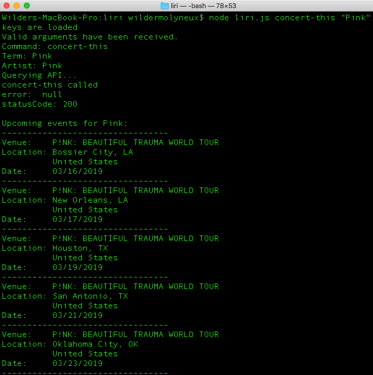
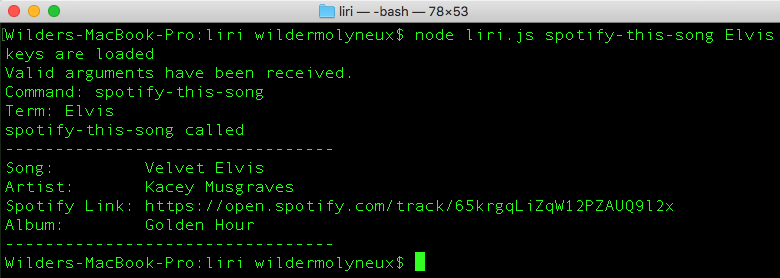
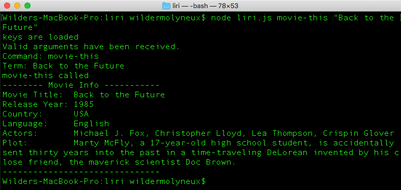
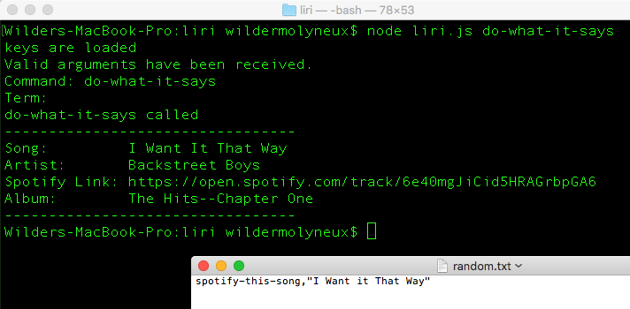

# liri-node-app
### LIRI is a Language Interpretation and Recognition Interface.

## About:
LIRI is a Node.js command line interface (CLI) application that can be instructed to execute a command to search Bands in Town, Spotify, and the Open Movie Database (OMDB) via three separate web APIs. Before you attempt to use LIRI, ensure that you have installed Node.js on your computer. Also, you will need to obtain your own API keys for Bands In Town, Spotify, and the OMDB. Instructions for where to place those keys are found below. Lastly, you need to understand which commands LIRI can accept (before you get creative and augment the program).

## Commands:
There are four commands available for use. On the command line, they can be used in the following generic format: 

> $  node liri.js <command> <"your search term">

The commands available are as follows:
* concert-this
* spotify-this-song
* movie-this
* do-what-it-says

The search term you choose will depend on which command you give LIRI. For example, if you hope to see a concert performed by Tenacous D, your search term would be "Tenacous D." Similarly, if the name of a song or movie you desire to learn more about, you might use search terms of "Best Song Ever" or "Citizen Kane" for the respective search. Be sure to actually include a term to search for in order to not recieve a console logged error or a programmatic default value term.

Here is an example LIRI command that you might start out with to get a feel for how it works:

> $ node liri.js movie-this "The Matrix"

## API Keys:
Not included with these files is a .env environment settings file. You will want to create some API keys for Bands in Town, Spotify, and the Open Movie Database (OMDB), then populate those secrets in a .env file located in the root directory of this project. Your .env file will contain:

> SPOTIFY_ID=<replace_with_your_identifier>

> SPOTIFY_SECRET=<replace_with_your_secret>

> OMDB_ID=<replace_with_your_identifier>

> BANDS_IN_TOWN_ID=_with_your_identifier>

## Setup:
To run this application, you will need [Node JS](https://nodejs.org/en/download/ "Node.js") installed on your computer.

Once Node JS has been installed on your computer, open up your command prompt and type the following:

1. git clone https://github.com/Wilder101/liri-node-app

2. cd liri-node-app

3. npm install

You are now ready to run the app!

## Running the App:
To use, simply type "node liri.js" followed by one of the following:

1. concert-this "any artist name"

2. spotify-this-song "any song name"

3. movie-this "any movie name" 

4. do-what-it-says

**Example - "concert-this" - allows user to search for upcoming concert information via the Bands in Town API.**

**Example - "spotify-this-song" - allows user to search for a song via the Spotify API.**

**Example - "movie-this" - allows user to search for a movie via the OMDB API.**

**Example - "do-what-it-says" - allows user to query based on the command and argument stored in the random.txt file**

## Author:
*Wilder Molyneux*
